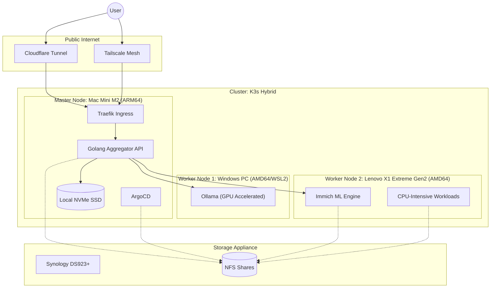
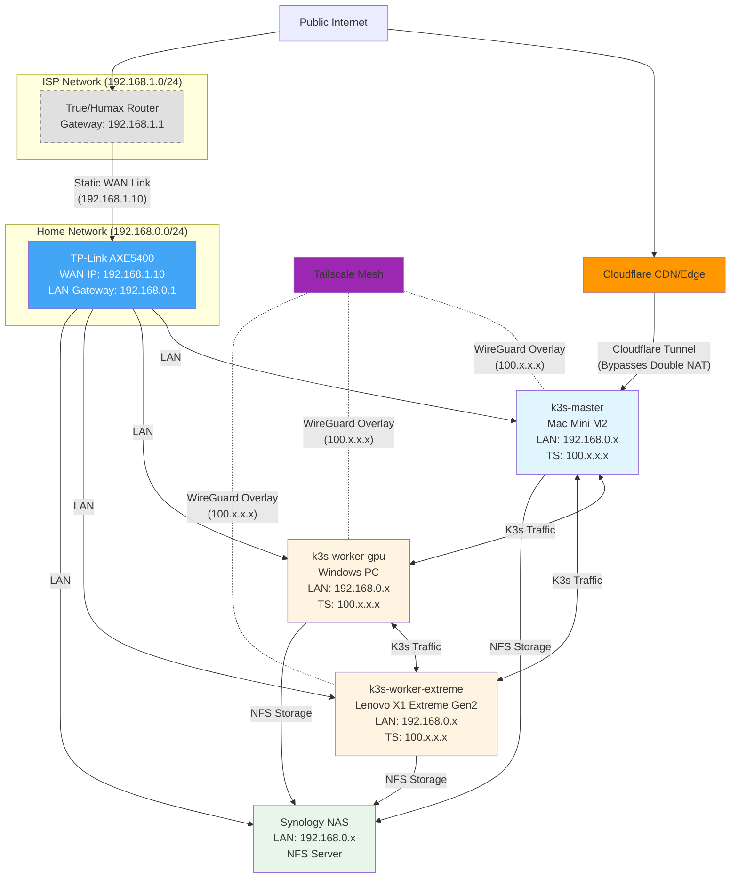
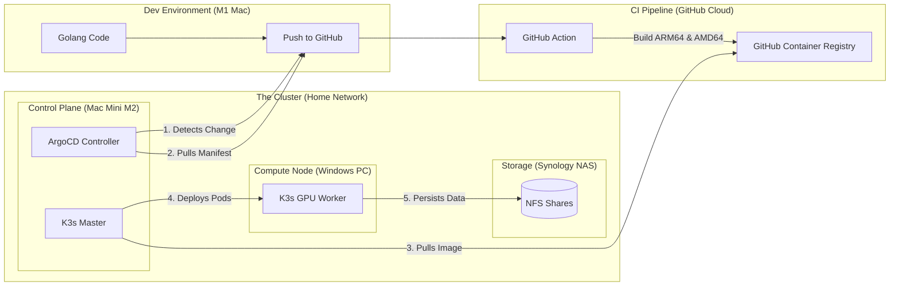

# HomeBrain: AI-Powered Home Operations Platform

-orange)

**HomeBrain** is an Internal Developer Platform (IDP) designed to manage, aggregate, and query personal data (Finance, Media, Infrastructure) through a unified Golang API and Local LLM interface.

It transforms a standard Home Lab into a production-grade, Cloud-Native environment, replacing SaaS subscriptions (Google Photos, Dropbox, YNAB) with self-hosted, AI-enhanced alternatives.

## Architecture

The system runs on a **Hybrid-Architecture Kubernetes Cluster** (K3s), utilizing the **"Brain & Muscle"** pattern to optimize for power efficiency and AI performance:

* **The Brain (Control Plane):** Mac Mini M2 (ARM64). Runs 24/7, handling the API, Orchestration, and lightweight apps. Low power consumption (~5W).
* **The Muscle (GPU Worker):** Gaming PC (Intel i5/RTX 4060). Wakes on LAN to handle heavy AI Inference (Ollama/LLMs) and GPU-accelerated workloads.
* **The Workhorse (Compute Worker):** Lenovo X1 Extreme Gen2 (Intel i7/32GB RAM). Runs Ubuntu bare metal for CPU-intensive workloads and Immich ML processing.
* **The Vault (Storage):** Synology DS923+. Provides persistent NFS storage for the cluster.

### Runtime Architecture

### Network Architecture

### CI/CD Pipeline

## Tech Stack

| Domain | Technology | Rationale |
| :--- | :--- | :--- |
| **Orchestration** | **K3s** | Lightweight Kubernetes distribution suitable for hybrid architectures. |
| **GitOps** | **ArgoCD** | Declarative continuous delivery; "Cluster as Code." |
| **Backend** | **Golang** | High-concurrency API gateway to aggregate disparate services. |
| **AI / ML** | **Ollama + NVIDIA** | Leveraging RTX 4060 (Tensor Cores) for fast local LLM inference. |
| **Networking** | **Tailscale** | Zero-trust Mesh VPN for secure Node-to-Node communication. |
| **Storage** | **NFS (Synology)** | Decoupled storage layer for persistent volumes. |

## Quick Start

For detailed infrastructure setup instructions, see the [Infrastructure Runbook](docs/runbooks/01-infrastructure.md).

**TL;DR:**
1. Provision K3s master on Mac Mini M2 (via Multipass)
2. Join GPU worker node (Windows PC with RTX 4060)
3. Join compute worker node (Lenovo X1 Extreme Gen2)
4. Configure NFS storage (Synology DS923+)
5. Setup external access (Cloudflare Tunnel)

For step-by-step instructions with troubleshooting, refer to:
- [RB-001: Phase 1 Infrastructure Setup](docs/runbooks/01-infrastructure.md)
- [RB-003: Cloudflare Tunnel Setup](docs/runbooks/02-cloudflare-tunnel.md)

## Roadmap

This project is executed in three distinct engineering phases.

  - [x] **Phase 1: Infrastructure & GitOps** (✅ Complete)
      - [x] Provision K3s Master on Mac Mini M2
      - [x] Configure Windows PC as GPU Worker Node (via WSL2/Tailscale)
      - [x] Configure Lenovo X1 Extreme Gen2 as Compute Worker Node
      - [x] Implement ArgoCD for automated application syncing
      - [x] Configure Synology as NFS Storage Provider
      - [ ] Setup Traefik Ingress Controller
      - [ ] Deploy monitoring stack (Prometheus/Grafana)
  - [ ] **Phase 2: The Aggregator Backend** (Golang/Gin) - Next
  - [ ] **Phase 3: The AI Agent** (Ollama/RAG with RTX 4060)

## Security & Privacy

  * **Secrets Management:** No secrets are stored in this repo. We use `.env` files locally and Kubernetes Secrets/Sealed Secrets in production.
  * **Network:** No ports are forwarded on the router. All ingress is handled via encrypted Tunnels.
  * **Data:** All data resides locally on the NAS; no PII is sent to public AI APIs.

-----

*Author: Kanokgan - Senior Software Engineer specializing in Backend & Cloud-Native Systems.*