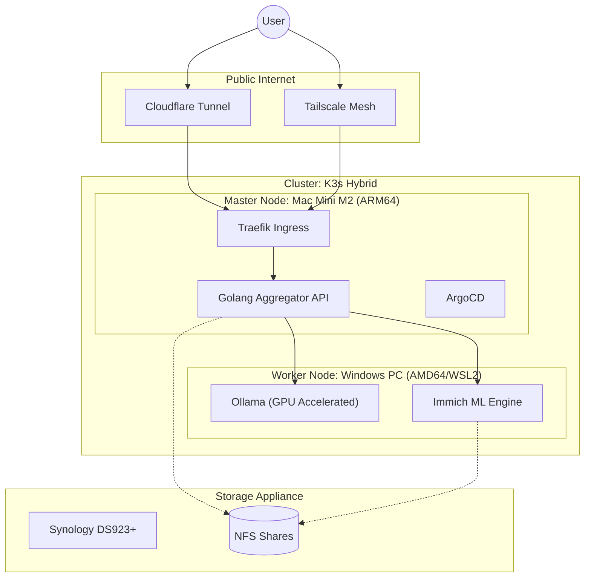

# 🧠 HomeBrain: AI-Powered Home Operations Platform


-orange)

**HomeBrain** is an Internal Developer Platform (IDP) designed to manage, aggregate, and query personal data (Finance, Media, Infrastructure) through a unified Golang API and Local LLM interface.

It transforms a standard Home Lab into a production-grade, Cloud-Native environment, replacing SaaS subscriptions (Google Photos, Dropbox, YNAB) with self-hosted, AI-enhanced alternatives.

## 🏗 Architecture

The system runs on a **Hybrid-Architecture Kubernetes Cluster** (K3s), utilizing the **"Brain & Muscle"** pattern to optimize for power efficiency and AI performance:

* **The Brain (Control Plane):** Mac Mini M2 (ARM64). Runs 24/7, handling the API, Orchestration, and lightweight apps. Low power consumption (~5W).
* **The Muscle (AI Worker):** Gaming PC (Intel i5/RTX 4060). Wakes on LAN to handle heavy AI Inference (Ollama/LLMs) and Batch Processing.
* **The Vault (Storage):** Synology DS923+. Provides persistent NFS storage for the cluster.



## 🛠 Tech Stack

| Domain | Technology | Rationale |
| :--- | :--- | :--- |
| **Orchestration** | **K3s** | Lightweight Kubernetes distribution suitable for hybrid architectures. |
| **GitOps** | **ArgoCD** | Declarative continuous delivery; "Cluster as Code." |
| **Backend** | **Golang** | High-concurrency API gateway to aggregate disparate services. |
| **AI / ML** | **Ollama + NVIDIA** | Leveraging RTX 4060 (Tensor Cores) for fast local LLM inference. |
| **Networking** | **Tailscale** | Zero-trust Mesh VPN for secure Node-to-Node communication. |
| **Storage** | **NFS (Synology)** | Decoupled storage layer for persistent volumes. |

## 🚀 Infrastructure Runbook (Phase 1)

**Objective:** Provision the K3s Control Plane on the Mac Mini M2 using Multipass and Tailscale.

### 1\. Master Node Provisioning (Mac Mini M2)

We use **Multipass** to run a native ARM64 Ubuntu VM. This isolates the cluster from the macOS host while retaining native performance.

```bash
# 1. Launch the VM with Cloud-Init to pre-install Tailscale
multipass launch --name k3s-master \
  --cpus 2 \
  --memory 4G \
  --disk 20G \
  --cloud-init - <<EOF
package_update: true
package_upgrade: true
runcmd:
  - curl -fsSL https://tailscale.com/install.sh | sh
EOF

# 2. Authenticate Tailscale (Manual Step)
multipass exec k3s-master -- sudo tailscale up
# > Copy the auth link and approve in Tailscale Admin Console.
# > CRITICAL: Disable "Key Expiry" for this machine in Tailscale Console.
```

### 2\. K3s Installation (Tailscale Binding)

**Critical Architecture Decision:** We bind K3s explicitly to the `tailscale0` interface. This ensures that all Pod-to-Pod traffic is encrypted via WireGuard (Tailscale) and allows nodes on different physical networks (like the Windows PC) to join the cluster seamlessly.

```bash
# 1. Get the Tailscale IP
TS_IP=$(multipass exec k3s-master -- tailscale ip -4)

# 2. Install K3s with Network Overrides
multipass exec k3s-master -- bash -c "curl -sfL https://get.k3s.io | INSTALL_K3S_EXEC='server \
  --node-ip ${TS_IP} \
  --node-external-ip ${TS_IP} \
  --flannel-iface tailscale0 \
  --disable traefik \
  --write-kubeconfig-mode 644' sh -"
```

### 3\. Developer Access (Host Machine)

To control the cluster via VS Code on macOS:

```bash
# 1. Export Config
multipass exec k3s-master -- sudo cat /etc/rancher/k3s/k3s.yaml > ~/.kube/config-homebrain

# 2. Update IP (Replace localhost with Tailscale IP)
sed -i '' "s/127.0.0.1/$(multipass exec k3s-master -- tailscale ip -4)/g" ~/.kube/config-homebrain

# 3. Test Connection
export KUBECONFIG=~/.kube/config-homebrain
kubectl get nodes
```

## 🗺 Roadmap

This project is executed in three distinct engineering phases.

  - [x] **Phase 1: Infrastructure & GitOps** (Current)
      - [x] Provision K3s Master on Mac Mini M2.
      - [ ] **NEW:** Configure Windows PC as GPU Worker Node (via WSL2/Tailscale).
      - [ ] **NEW:** Configure Synology as NFS Storage Provider.
      - [ ] Implement ArgoCD for automated application syncing.
  - [ ] **Phase 2: The Aggregator Backend** (Golang/Gin)
  - [ ] **Phase 3: The AI Agent** (Ollama/RAG with RTX 4060)

## 🔐 Security & Privacy

  * **Secrets Management:** No secrets are stored in this repo. We use `.env` files locally and Kubernetes Secrets/Sealed Secrets in production.
  * **Network:** No ports are forwarded on the router. All ingress is handled via encrypted Tunnels.
  * **Data:** All data resides locally on the NAS; no PII is sent to public AI APIs.

-----

*Author: Kanokgan - Senior Software Engineer specializing in Backend & Cloud-Native Systems.*