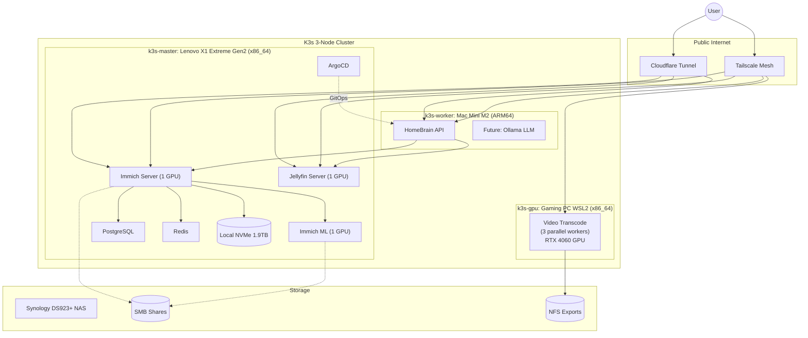
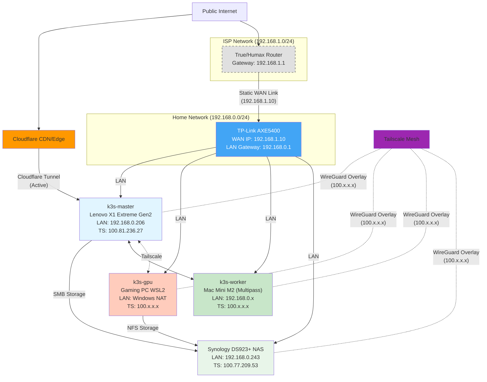
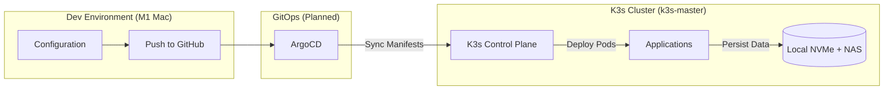

# HomeBrain: AI-Powered Home Operations Platform

-orange)

**HomeBrain** is an Internal Developer Platform (IDP) designed to manage, aggregate, and query personal data (Finance, Media, Infrastructure) through a unified Golang API and Local LLM interface.

It transforms a standard Home Lab into a production-grade, Cloud-Native environment, replacing SaaS subscriptions (Google Photos, Dropbox, YNAB) with self-hosted, AI-enhanced alternatives.

## Architecture

The system runs on a **3-Node K3s Cluster** with workload specialization:

* **k3s-master (Control Plane + GPU Workloads):** Lenovo X1 Extreme Gen2 (Intel i7-9750H 6C/12T, 32GB RAM, NVIDIA GTX 1650 Mobile 4GB). Ubuntu 24.04 LTS bare metal running K3s v1.33.6+k3s1. Handles GPU-intensive workloads (Immich, Jellyfin) with GPU time-slicing (4 virtual GPUs).
* **k3s-gpu (GPU Transcoding Workloads):** Gaming PC (Intel i5-13400 16C, RTX 4060 8GB VRAM). WSL2 Ubuntu 24.04 on Windows running K3s v1.34.3+k3s1. Dedicated to GPU-accelerated video transcoding and batch processing. Joined via Tailscale mesh network.
* **k3s-worker (API & LLM Workloads):** Mac Mini M2 (ARM64, 8GB RAM). Multipass Ubuntu VM running K3s v1.34.3+k3s1. Dedicated to API services and future LLM inference workloads. *Note: Currently in Unknown state, not actively used.*
* **Storage:** 1.9TB local NVMe SSD for hot data (K3s local-path provisioner). NAS (Synology DS923+ at 192.168.0.243) mounted via CIFS/SMB 3.1.1 and NFS for external photo libraries, media, and video transcoding.

### Runtime Architecture

### Network Architecture

### CI/CD Pipeline

## Tech Stack

| Domain | Technology | Rationale |
| :--- | :--- | :--- |
| **Orchestration** | **K3s** | Lightweight Kubernetes distribution. 3-node cluster: k3s-master (x86_64) + k3s-gpu (x86_64 WSL2) + k3s-worker (ARM64). |
| **Backend API** | **Golang (Gin) + Docker (Multi-arch)** | HomeBrain API for service health monitoring and aggregation. Deployed on ARM64 worker node. |
| **Applications** | **Immich + Jellyfin** | Self-hosted photo/media management with GPU-accelerated ML (face recognition, CLIP embeddings, transcoding). |
| **GitOps** | **ArgoCD** | Automated deployment and sync from GitHub. Manages HomeBrain API and future services. |
| **AI / ML** | **CUDA + NVIDIA GPUs** | k3s-master: GTX 1650 (4x time-sliced) for Immich ML, Jellyfin transcoding. k3s-gpu: RTX 4060 for batch video transcoding (GPU sharing - 3 parallel workers without resource limits). Future: Ollama LLM on ARM64 worker. |
| **Networking** | **Tailscale + Cloudflare Tunnel** | Zero-trust mesh VPN for private access (*.dove-komodo.ts.net), Cloudflare Tunnel for public access (*.kanokgan.com). k3s-gpu joined via Tailscale overlay. No traditional ingress controller - Traefik disabled. |
| **Storage** | **Local NVMe + CIFS + NFS** | 1.9TB local NVMe for hot data (K3s local-path), Synology DS923+ NAS via optimized CIFS mounts for read-only external libraries and NFS for video transcoding workloads. |

## Quick Start

For detailed infrastructure setup instructions, see the [Infrastructure Runbook](docs/runbooks/01-infrastructure.md).

**Current Deployment:**
1. ✅ K3s 3-node cluster: k3s-master v1.33.6 (x86_64) + k3s-gpu v1.34.3 (x86_64 WSL2 on gaming PC) + k3s-worker v1.34.3 (ARM64/Mac Mini M2 via Multipass - currently Unknown state)
2. ✅ NVIDIA GPU support: k3s-master with Container Toolkit and device plugin (4x virtual GPUs via time-slicing), k3s-gpu with RTX 4060 for batch workloads
3. ✅ Immich photo management with GPU-accelerated ML (1 GPU slice each for server + ML on k3s-master)
4. ✅ Jellyfin media server with GPU transcoding (1 GPU slice on k3s-master)
5. ✅ GPU-accelerated video transcoding job on k3s-gpu: 3 parallel workers with file locking, CUDA decode+encode, automatic source deletion, NFS mounts to NAS
6. ✅ HomeBrain API (Golang/Gin) - service health monitoring for Immich/Jellyfin (planned for k3s-worker)
7. ✅ ArgoCD for GitOps deployment automation
8. ✅ Redis with AOF persistence + ML model cache (persistent storage)
9. ✅ Tailscale mesh for secure private access (HTTPS on *.dove-komodo.ts.net)
10. ✅ Cloudflare Tunnel for public access (*.kanokgan.com)
11. ✅ Monitoring stack: Prometheus, Grafana, Promtail, node-exporter (Loki available but scaled to 0)
12. ✅ Filebrowser for SSD/NAS management via Tailscale

For step-by-step instructions with troubleshooting, refer to:
- [RB-001: Infrastructure Setup](docs/runbooks/01-infrastructure.md)
- [RB-002: Cloudflare Tunnel Setup](docs/runbooks/02-cloudflare-tunnel.md)
- [RB-003: GPU Configuration](docs/runbooks/03-gpu-configuration.md)
- [RB-004: Immich Deployment](docs/runbooks/04-immich-deployment.md)
- [RB-005: Jellyfin Deployment](docs/runbooks/05-jellyfin-deployment.md)
- [RB-008: k3s-gpu WSL2 Setup](docs/runbooks/08-k3s-gpu-wsl2.md)
- [RB-009: Video Transcoding Job](docs/runbooks/09-video-transcoding.md)

## Roadmap

This project is executed in distinct engineering phases.

  - [x] **Phase 1: Infrastructure & Core Services** (Complete)
      - [x] Provision K3s single-node cluster on Ubuntu 24.04
      - [x] Add k3s-gpu node (Gaming PC with RTX 4060, WSL2 Ubuntu 24.04)
      - [x] Add k3s-worker node (Mac Mini M2, ARM64 via Multipass - currently in Unknown state)
      - [x] Configure NVIDIA GPU support on k3s-master (GTX 1650 with 4x time-slicing) and k3s-gpu (RTX 4060 with GPU sharing)
      - [x] Deploy GPU-accelerated video transcoding job with 3 parallel workers, file locking, and automatic source deletion
      - [x] Disable Traefik - use Cloudflare Tunnel + Tailscale instead
      - [x] Configure Synology NAS with optimized CIFS mounts (SMB 3.1.1, 128KB buffers) and NFS for video transcoding
      - [x] Setup security: Pod Security Standards, RBAC
      - [x] Deploy Immich with GPU-accelerated ML + persistent Redis/ML cache (1 GPU slice each for server + ML)
      - [x] Deploy Jellyfin with GPU transcoding (1 GPU slice)
      - [x] Complete Tailscale HTTPS access (*.dove-komodo.ts.net)
      - [x] Setup Cloudflare tunnel (*.kanokgan.com)
      - [x] Deploy Filebrowser for file management
      - [x] Deploy monitoring stack (Prometheus/Grafana/Promtail)
      - [ ] Re-enable Loki for log aggregation
      - [ ] Implement automated backups to NAS
  - [x] **Phase 2: GitOps & API Development** (In Progress - 60% Complete)
      - [x] Deploy ArgoCD for GitOps workflow
      - [x] Build HomeBrain API (Golang/Gin) with multi-arch Docker support
      - [x] Implement service health monitoring (Immich, Jellyfin)
      - [x] Deploy API to k3s-worker via ArgoCD
      - [ ] Setup automated image updates
      - [ ] Add Tailscale access for API
      - [ ] Extend API with Immich query capabilities
  - [ ] **Phase 3: Additional Services**
      - [ ] Deploy Ollama for local LLM inference
      - [ ] Add financial tracking (YNAB alternative)
      - [ ] Build Golang aggregator API

## Security & Privacy

  * **Secrets Management:** No secrets are stored in this repo. We use `.env` files locally and Kubernetes Secrets/Sealed Secrets in production.
  * **Network:** No ports are forwarded on the router. All ingress is handled via encrypted Tunnels.
  * **Data:** All data resides locally on the NAS; no PII is sent to public AI APIs.

-----

*Author: Kanokgan - Senior Software Engineer specializing in Backend & Cloud-Native Systems.*