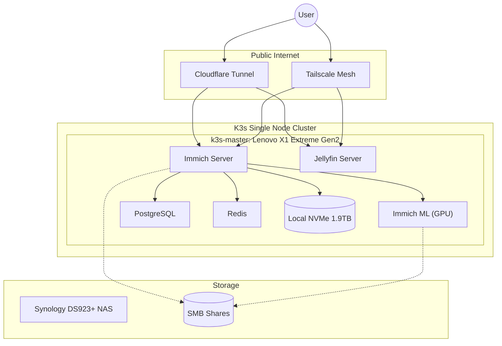
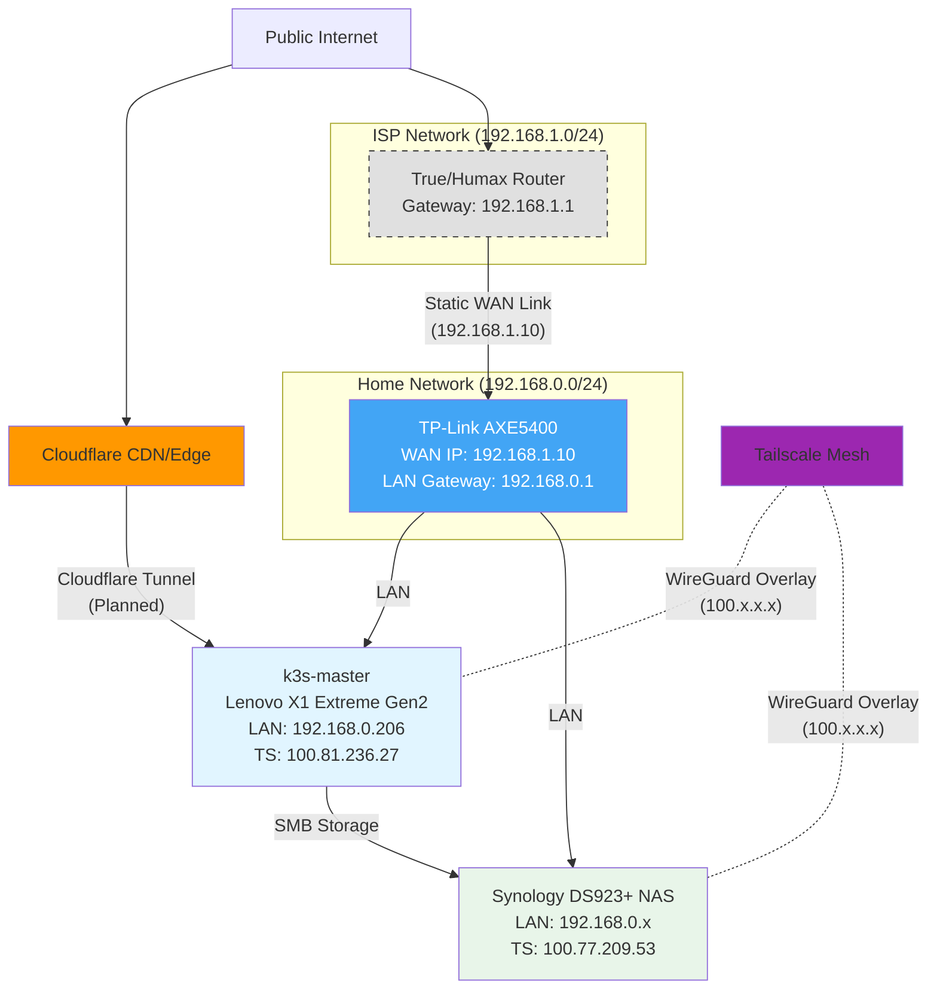
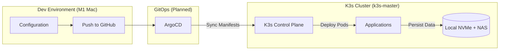

# HomeBrain: AI-Powered Home Operations Platform

-orange)

**HomeBrain** is an Internal Developer Platform (IDP) designed to manage, aggregate, and query personal data (Finance, Media, Infrastructure) through a unified Golang API and Local LLM interface.

It transforms a standard Home Lab into a production-grade, Cloud-Native environment, replacing SaaS subscriptions (Google Photos, Dropbox, YNAB) with self-hosted, AI-enhanced alternatives.

## Architecture

The system runs on a **Single-Node K3s Cluster** optimized for self-hosted applications with GPU acceleration:

* **K3s Master Node:** Lenovo X1 Extreme Gen2 (Intel i7-9750H/32GB RAM/NVIDIA GTX 1650). Ubuntu 24.04 LTS bare metal running K3s v1.33.6. Handles all workloads with GPU acceleration for ML tasks.
* **Storage:** 1.9TB local NVMe SSD for high-performance storage. NAS (Synology DS923+) mounted via SMB for external libraries and backups.

### Runtime Architecture

### Network Architecture

### CI/CD Pipeline

## Tech Stack

| Domain | Technology | Rationale |
| :--- | :--- | :--- |
| **Orchestration** | **K3s** | Lightweight Kubernetes distribution for single-node deployment. |
| **Applications** | **Immich** | Self-hosted photo management with GPU-accelerated ML (face recognition, CLIP embeddings). |
| **AI / ML** | **CUDA + NVIDIA GTX 1650** | GPU acceleration for machine learning workloads. |
| **Networking** | **Tailscale + Cloudflare Tunnel** | Zero-trust mesh VPN for private access, Cloudflare Tunnel for public access. No traditional ingress controller. |
| **Storage** | **Local NVMe + NFS** | 1.9TB local NVMe for hot data, NAS for media libraries and backups. |

## Quick Start

For detailed infrastructure setup instructions, see the [Infrastructure Runbook](docs/runbooks/01-infrastructure.md).

**Current Deployment:**
1. ✅ K3s v1.33.6 on Ubuntu 24.04 LTS (Lenovo X1 Extreme Gen2) with Traefik disabled
2. ✅ NVIDIA GPU support with Container Toolkit and device plugin (4x virtual GPUs via time-slicing)
3. ✅ Immich photo management with GPU-accelerated ML (514GB data migrated)
4. ✅ Jellyfin media server with GPU transcoding (3x GPUs)
5. ✅ Tailscale mesh for secure private access (HTTPS on *.dove-komodo.ts.net)
6. ✅ Cloudflare Tunnel for public access (immich.kanokgan.com, jellyfin.kanokgan.com, argocd.kanokgan.com)
7. ✅ Filebrowser for SSD/NAS management via Tailscale

For step-by-step instructions with troubleshooting, refer to:
- [RB-001: Infrastructure Setup](docs/runbooks/01-infrastructure.md)
- [RB-002: Cloudflare Tunnel Setup](docs/runbooks/02-cloudflare-tunnel.md)
- [RB-003: Immich Deployment](docs/runbooks/03-immich-deployment.md)
- [Quick Setup: Cloudflare Tunnel](docs/CLOUDFLARE_TUNNEL_SETUP.md)

## Roadmap

This project is executed in distinct engineering phases.

  - [x] **Phase 1: Infrastructure & Core Services** (95% Complete)
      - [x] Provision K3s single-node cluster on Ubuntu 24.04
      - [x] Configure NVIDIA GPU support (GTX 1650 with 4x time-slicing)
      - [x] Disable Traefik - use Cloudflare Tunnel + Tailscale instead
      - [x] Configure Synology NAS as NFS storage
      - [x] Setup security: Pod Security Standards, RBAC, Network Policies
      - [x] Deploy Immich with GPU-accelerated ML
      - [x] Deploy Jellyfin with GPU transcoding
      - [x] Migrate 514GB production data from Docker
      - [x] Complete Tailscale HTTPS access (*.dove-komodo.ts.net)
      - [x] Setup Cloudflare tunnel (*.kanokgan.com)
      - [x] Deploy Filebrowser for file management
      - [ ] Deploy monitoring stack (Prometheus/Grafana)
      - [ ] Implement automated backups to NAS
  - [ ] **Phase 2: GitOps & Automation** - Next
      - [ ] Deploy ArgoCD for GitOps workflow
      - [ ] Setup automated image updates
      - [ ] Implement Infrastructure as Code for all services
  - [ ] **Phase 3: Additional Services**
      - [ ] Deploy Ollama for local LLM inference
      - [ ] Add financial tracking (YNAB alternative)
      - [ ] Build Golang aggregator API

## Security & Privacy

  * **Secrets Management:** No secrets are stored in this repo. We use `.env` files locally and Kubernetes Secrets/Sealed Secrets in production.
  * **Network:** No ports are forwarded on the router. All ingress is handled via encrypted Tunnels.
  * **Data:** All data resides locally on the NAS; no PII is sent to public AI APIs.

-----

*Author: Kanokgan - Senior Software Engineer specializing in Backend & Cloud-Native Systems.*