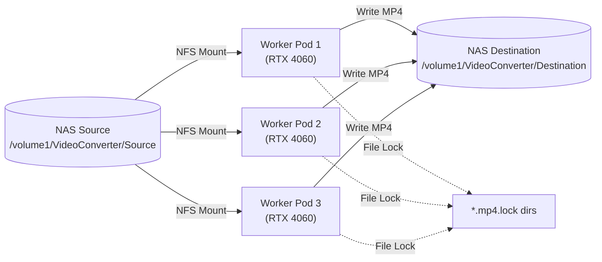

# RB-009: GPU-Accelerated Video Transcoding

**Status:** ✅ Production  
**Node:** k3s-gpu (RTX 4060)  
**Purpose:** Batch convert videos to H.264/AAC MP4 with GPU acceleration  
**Performance:** 3x faster than single worker, ~10-20x faster than CPU-only

## Overview

This runbook documents the automated video transcoding job that converts videos from a NAS source directory to optimized H.264/AAC MP4 format with GPU-accelerated encoding. The job runs 3 parallel workers on k3s-gpu, achieving 99% GPU utilization.

**Key Features:**
- **GPU Acceleration:** CUDA hardware decode + NVENC encoding
- **Parallel Processing:** 3 concurrent workers with file locking
- **Automatic Source Deletion:** Source files deleted after successful transcode
- **Format Detection:** Skips already-correct files (moves without transcoding)
- **Progress Tracking:** Real-time progress counters in logs
- **NFS Integration:** Direct read/write to NAS storage

## Architecture



## Prerequisites

### NAS Configuration

1. **Create NFS Exports** on Synology NAS:
   ```
   # Control Panel > Shared Folder > Edit > NFS Permissions
   Source: /volume1/VideoConverter/Source
   - Hostname/IP: 192.168.0.0/24
   - Privilege: Read/Write
   - Squash: No mapping
   
   Destination: /volume1/VideoConverter/Destination
   - Hostname/IP: 192.168.0.0/24
   - Privilege: Read/Write
   - Squash: No mapping
   ```

2. **Verify NFS from k3s-gpu:**
   ```bash
   # In WSL2 on k3s-gpu
   showmount -e 192.168.0.243
   
   # Expected output:
   # Export list for 192.168.0.243:
   # /volume1/VideoConverter/Source      192.168.0.0/24
   # /volume1/VideoConverter/Destination 192.168.0.0/24
   ```

### K3s Node Requirements

- k3s-gpu node with RTX 4060 ready (see [RB-008](08-k3s-gpu-wsl2.md))
- NVIDIA Device Plugin deployed
- NFS client installed on k3s-gpu (`nfs-common` package)

## Deployment

### Step 1: Review Configuration

The transcoding job consists of 3 Kubernetes manifests in `k8s/media-transcode/`:

```bash
ls k8s/media-transcode/
# namespace.yaml        - media-transcode namespace
# transcode-script.yaml - ConfigMap with transcoding script
# transcode-job.yaml    - Job configuration
```

### Step 2: Deploy the Job

```bash
# Deploy all components
kubectl apply -f k8s/media-transcode/

# Verify namespace
kubectl get namespace media-transcode

# Verify ConfigMap
kubectl get configmap -n media-transcode

# Verify Job is created
kubectl get job -n media-transcode
```

### Step 3: Monitor Progress

```bash
# Check pod status (should see 3 pods running)
kubectl get pods -n media-transcode

# Expected output:
# NAME                      READY   STATUS    RESTARTS   AGE
# video-transcode-9f6k8     1/1     Running   0          2m
# video-transcode-pr5tk     1/1     Running   0          2m
# video-transcode-vww2k     1/1     Running   0          2m

# Watch logs from all workers (opens 3 terminals)
kubectl logs -n media-transcode video-transcode-9f6k8 -f
kubectl logs -n media-transcode video-transcode-pr5tk -f
kubectl logs -n media-transcode video-transcode-vww2k -f

# Or follow logs from one pod
kubectl logs -n media-transcode -l app=video-transcode --tail=50 -f
```

## Understanding the Output

### Log Format

```
===================================
Video Transcoding Job Started
===================================
Input directory: /media/source
Output directory: /media/destination
Date: Mon Jan 13 10:30:00 UTC 2025

📊 Scanning for video files...
Found 153 video files to process

[1/153] 🎬 Processing: folder1/video1.mkv
   Output: /media/destination/folder1/video1.mp4
   🚀 Using NVIDIA GPU acceleration (decode + encode)
   ✅ SUCCESS - Deleting source
   
[2/153] ⏭️  SKIP: folder1/video2.mp4 (output already exists)
   🗑️  Deleting source file (output complete)
   
[3/153] 🔒 SKIP: folder2/video3.avi (being processed by another pod)

===================================
Transcoding Job Complete
===================================
Processed: 48 files
Skipped: 105 files
Failed: 0 files
Note: Successfully processed files are deleted from source
Date: Mon Jan 13 14:30:00 UTC 2025
===================================
```

### Status Indicators

| Icon | Meaning | Action |
|------|---------|--------|
| 🎬 | Processing | Transcoding in progress |
| ✅ | SUCCESS | Transcode complete, source deleted |
| ⏭️ | SKIP | Already in correct format or output exists |
| 🔒 | SKIP (locked) | Another worker is processing this file |
| ❌ | FAILED | Transcode failed, source kept for retry |
| 🗑️ | Delete | Source file being removed |

## GPU Monitoring

### From Windows (on k3s-gpu)

Open Task Manager > Performance > GPU:
- **Video Encode:** Should be ~99% during active transcoding
- **Video Decode:** ~40% (not all codecs support GPU decode)
- **Temperature:** Monitor to ensure <85°C
- **Memory:** ~1-2GB usage per worker

### From Command Line

```bash
# In WSL2 on k3s-gpu
watch -n 1 '/usr/lib/wsl/lib/nvidia-smi'

# Look for:
# GPU-Util: 99%
# Memory-Usage: 2000MiB / 8188MiB
# Processes: 3x ffmpeg processes
```

## File Locking Mechanism

The job uses atomic directory creation for distributed locking:

```bash
# When worker starts processing "video.mp4":
mkdir /media/destination/path/video.mp4.lock

# If another worker tries the same file:
mkdir /media/destination/path/video.mp4.lock  # Fails!
# Worker skips and moves to next file

# After success/failure:
rmdir /media/destination/path/video.mp4.lock
```

**Why directories, not files?**
- `mkdir` is atomic on NFS
- Race condition free (kernel guarantees)
- Works across multiple pods

## Supported Formats

### Input Formats
- `.mkv` (Matroska)
- `.avi` (AVI)
- `.mov` (QuickTime)
- `.wmv` (Windows Media)
- `.flv` (Flash Video)
- `.webm` (WebM)
- `.m4v` (iTunes)
- `.mpg`, `.mpeg` (MPEG)
- `.mp4` (will be checked and converted if needed)

### Output Format
- **Container:** MP4
- **Video Codec:** H.264 (NVENC)
  - Preset: P4 (balanced quality/speed)
  - Tune: High Quality
  - Rate Control: VBR
  - CQ: 23 (quality target)
  - Max bitrate: 10Mbps
- **Audio Codec:** AAC
  - Bitrate: 192kbps
  - Channels: Stereo (2.0)
- **Optimization:** Fast start (web streaming ready)

## Job Configuration

### Parallelism

Current configuration runs **3 workers**:

```yaml
# k8s/media-transcode/transcode-job.yaml
spec:
  parallelism: 3      # 3 pods run concurrently
  completions: 3      # Job completes when all 3 finish
```

**Tuning Recommendations:**
- **RTX 4060 (8GB):** 3 workers optimal (99% GPU utilization)
- **RTX 3060 (12GB):** 4-5 workers possible
- **RTX 4090 (24GB):** 6-8 workers

Adjust based on GPU memory and temperature:
```bash
# Edit job configuration
vi k8s/media-transcode/transcode-job.yaml

# Update parallelism and completions to same value
# Then redeploy:
kubectl delete job video-transcode -n media-transcode
kubectl apply -f k8s/media-transcode/transcode-job.yaml
```

### GPU Sharing

**Important:** Job does NOT request GPU resources:

```yaml
# No GPU limits/requests - enables sharing
resources:
  requests:
    memory: "4Gi"
    cpu: "2"
  limits:
    memory: "8Gi"
    cpu: "4"
```

This allows multiple pods to share the single RTX 4060. If you add GPU limits, only 1 pod will run:

```yaml
# Don't do this unless you want 1 worker:
resources:
  limits:
    nvidia.com/gpu: "1"  # Blocks other pods!
```

## Troubleshooting

### Issue: Pods stuck in Pending

**Check:**
```bash
kubectl describe pod -n media-transcode video-transcode-XXXXX
```

**Possible causes:**
1. **No GPU available:** Node not ready or device plugin failed
   ```bash
   kubectl describe node k3s-gpu | grep nvidia.com/gpu
   ```
   
2. **NFS mount failed:** Check NFS exports and network
   ```bash
   showmount -e 192.168.0.243
   ```
   
3. **Node selector:** Job requires k3s-gpu node
   ```bash
   kubectl get nodes -l kubernetes.io/hostname=k3s-gpu
   ```

### Issue: Pod CrashLoopBackOff

**Check logs:**
```bash
kubectl logs -n media-transcode video-transcode-XXXXX
```

**Common causes:**
1. **NFS not accessible:** Check NAS network/permissions
2. **NVIDIA libraries missing:** See [RB-008 Troubleshooting](08-k3s-gpu-wsl2.md#troubleshooting)
3. **Script syntax error:** Verify ConfigMap

### Issue: GPU not being used (CPU encoding)

**Symptom:** Logs show "💻 Using CPU encoding"

**Causes:**
1. **NVIDIA libraries not mounted:**
   ```yaml
   # transcode-job.yaml should have:
   volumeMounts:
   - name: nvidia-libs
     mountPath: /usr/local/nvidia/lib64
   volumes:
   - name: nvidia-libs
     hostPath:
       path: /usr/lib/wsl/lib
   ```

2. **LD_LIBRARY_PATH not set:**
   ```yaml
   env:
   - name: LD_LIBRARY_PATH
     value: "/usr/local/nvidia/lib64:/usr/lib/x86_64-linux-gnu"
   ```

3. **Container missing CUDA:** Use `jrottenberg/ffmpeg:6.1-nvidia` image

### Issue: Files being skipped (locked)

**Symptom:** Many "🔒 SKIP: ... (being processed by another pod)"

**This is normal!** It means file locking is working. Workers coordinate to avoid conflicts.

**If ALL files are locked:**
- Check for stale `.lock` directories on NAS
- Manually remove orphaned locks:
  ```bash
  find /volume1/VideoConverter/Destination -name "*.lock" -type d
  # Review and remove if no worker is processing
  ```

### Issue: Source files not being deleted

**Symptom:** Source files remain after successful transcode

**Causes:**
1. **NFS read-only:** Check NFS export has Read/Write permission
2. **Permission denied:** Check NFS squash settings (should be "No mapping")
3. **Script failed before deletion:** Check logs for errors before delete step

### Issue: Job never completes

**Symptom:** Pods stay running forever

**Cause:** While loop in script processes all files. Job completes when pods exit.

**Expected behavior:**
- Pods run until all files processed
- Each pod exits with status 0
- Job marked as Complete

**If stuck:**
```bash
# Check pod status
kubectl get pods -n media-transcode

# If Running for hours with no new logs, may be hung
# Check last log timestamp:
kubectl logs -n media-transcode video-transcode-XXXXX --tail=10

# Force delete if truly stuck:
kubectl delete pod video-transcode-XXXXX -n media-transcode --force
```

## Cleanup

### After Job Completes

```bash
# Job auto-deletes after 24 hours (ttlSecondsAfterFinished: 86400)
# Or manually delete:
kubectl delete job video-transcode -n media-transcode

# Cleanup completed pods
kubectl delete pod -n media-transcode --field-selector=status.phase=Succeeded
```

### Remove Lock Files (Emergency)

```bash
# If workers crashed and left lock files:
# SSH to NAS or use File Station
find /volume1/VideoConverter/Destination -name "*.lock" -type d -exec rmdir {} \;
```

## Running the Job Again

```bash
# Job can be re-run anytime for new files
kubectl delete job video-transcode -n media-transcode
kubectl apply -f k8s/media-transcode/transcode-job.yaml

# Or use kubectl replace:
kubectl replace --force -f k8s/media-transcode/transcode-job.yaml
```

**Note:** Job will skip already-transcoded files (checks output directory first)

## Performance Benchmarks

Tested on RTX 4060 with 153 video files (mixed formats):

| Configuration | Time | GPU Utilization | Notes |
|---------------|------|-----------------|-------|
| 1 worker | ~8 hours | 45-60% | Underutilized |
| 2 workers | ~4.5 hours | 75-85% | Better utilization |
| 3 workers | ~2.5 hours | 99% | Optimal ⭐ |
| 4 workers | ~2.5 hours | 99% | No improvement, memory bottleneck |

**GPU Metrics (3 workers):**
- Video Encode: 99%
- Video Decode: 40% (codec dependent)
- Temperature: 46°C (stable)
- Memory: ~3GB / 8GB
- CPU: 20% (minimal)

## Advanced Tuning

### Encoding Quality

Edit [transcode-script.yaml](../../k8s/media-transcode/transcode-script.yaml):

```bash
# Current settings (balanced):
-preset p4 -tune hq -rc vbr -cq 23 -b:v 5M -maxrate 10M

# Higher quality (slower):
-preset p7 -tune hq -rc vbr -cq 20 -b:v 8M -maxrate 15M

# Faster (lower quality):
-preset p1 -tune ll -rc vbr -cq 26 -b:v 3M -maxrate 6M
```

Preset options: p1 (fastest) to p7 (slowest)  
CQ values: 0 (lossless) to 51 (worst), recommend 20-28

### Audio Settings

```bash
# Current: AAC 192k stereo
-c:a aac -b:a 192k -ac 2

# Higher quality audio:
-c:a aac -b:a 256k -ac 2

# Keep original audio (no re-encode):
-c:a copy
```

### Disable Source Deletion

If you want to keep source files:

```bash
# Comment out deletion lines in transcode-script.yaml:
# rm "$input_file"
```

Redeploy ConfigMap:
```bash
kubectl apply -f k8s/media-transcode/transcode-script.yaml
```

## Integration with Other Services

### Jellyfin Auto-Scan

After transcoding, trigger Jellyfin library scan:

```bash
# Using Jellyfin API
curl -X POST "https://jellyfin.dove-komodo.ts.net/Library/Refresh" \
  -H "X-Emby-Token: YOUR_API_KEY"
```

Can be added as a post-job hook.

### Webhook Notifications

Add webhook to script for job completion:

```bash
# At end of transcode.sh:
curl -X POST https://your-webhook-url \
  -H "Content-Type: application/json" \
  -d "{\"processed\": $PROCESSED, \"failed\": $FAILED}"
```

## Next Steps

- Set up scheduled job: [Kubernetes CronJob](https://kubernetes.io/docs/concepts/workloads/controllers/cron-jobs/)
- Monitor with Prometheus: [GPU Exporter](https://github.com/NVIDIA/gpu-monitoring-tools)
- Build web UI for job management

## References

- [FFmpeg NVENC Guide](https://docs.nvidia.com/video-technologies/video-codec-sdk/ffmpeg-with-nvidia-gpu/)
- [NVIDIA Preset Guide](https://docs.nvidia.com/video-technologies/video-codec-sdk/nvenc-preset-migration-guide/)
- [H.264 Settings Reference](https://trac.ffmpeg.org/wiki/Encode/H.264)
